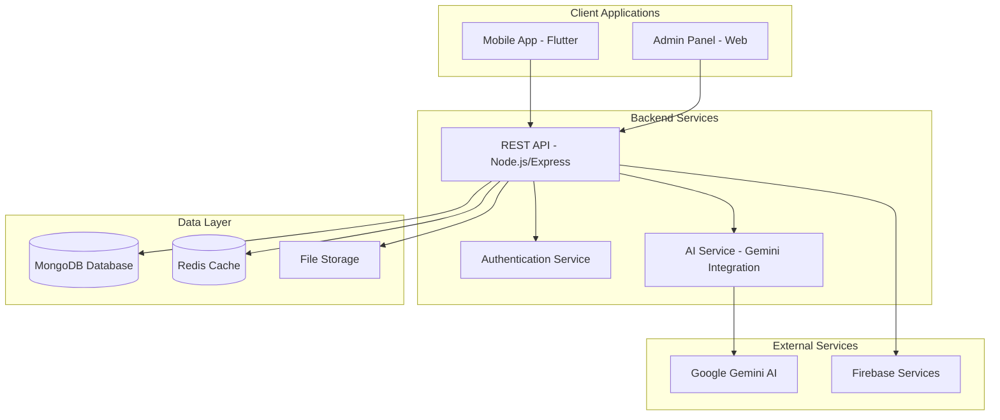

# 🍽️ Recipe App AI - Smart Recipe Creation Platform

<div align="center">


**An intelligent recipe creation platform that generates personalized recipes from ingredients using AI technology**

[🚀 Live Demo](#) • [📱 Mobile App](#) • [🔧 Admin Panel](#) • [📖 Documentation](./docs/)

</div>

---

## 📋 Table of Contents

- [🎯 Overview](#-overview)
- [✨ Features](#-features)
- [🏗️ Architecture](#️-architecture)
- [🚀 Quick Start](#-quick-start)
- [📱 Mobile Application](#-mobile-application)
- [🖥️ Admin Panel](#️-admin-panel)
- [🤖 AI Integration](#-ai-integration)
- [🛠️ Development](#️-development)
- [📚 Documentation](#-documentation)
- [🧪 Testing](#-testing)
- [🤝 Contributing](#-contributing)
- [📄 License](#-license)

---

## 🎯 Overview

Recipe App AI is a comprehensive platform that revolutionizes recipe creation through artificial intelligence. Users can simply upload ingredient images or describe available ingredients, and our AI generates detailed, personalized recipes instantly.

### 🌟 Key Highlights

- **AI-Powered Recipe Generation** using Google Gemini API
- **Cross-Platform Mobile App** built with Flutter
- **Administrative Web Panel** for content management
- **Multi-language Support** (Vietnamese & English)
- **Real-time Recipe Management** with offline capabilities
- **Enterprise-grade Architecture** with scalable backend

---

## ✨ Features

### 🍳 Core Features

#### Mobile Application
- 📷 **Smart Image Recognition** - Upload multiple ingredient photos
- 🤖 **AI Recipe Generation** - Get instant recipe suggestions
- 🌐 **Multi-language Support** - Vietnamese and English interfaces
- 💾 **Offline Storage** - Save recipes locally for offline access
- 🔍 **Advanced Search** - Find recipes by ingredients, cuisine, or dietary preferences
- ❤️ **Favorites Management** - Save and organize favorite recipes
- 📤 **Social Sharing** - Share recipes with friends and family

#### Admin Panel
- 👥 **User Management** - Monitor and manage user accounts
- 📊 **Analytics Dashboard** - Track usage statistics and trends
- 🍽️ **Recipe Moderation** - Review and approve user-generated content
- 🏷️ **Category Management** - Organize recipes by cuisine and type
- 📈 **Performance Monitoring** - Real-time application metrics

#### AI Capabilities
- 🧠 **Image Analysis** - Identify ingredients from photos
- 📝 **Natural Language Processing** - Understand ingredient descriptions
- 🎯 **Personalization** - Adapt recipes to dietary restrictions and preferences
- 🌍 **Cultural Adaptation** - Generate recipes based on regional cuisines
- ⚡ **Real-time Processing** - Instant recipe generation

---

## 🏗️ Architecture

### System Overview



### Technology Stack

#### Frontend
- **Mobile**: Flutter/Dart with BLoC state management
- **Web Admin**: React.js with Material-UI
- **Styling**: Custom themes with responsive design

#### Backend
- **API Server**: Node.js with Express.js framework
- **Database**: MongoDB with Mongoose ODM
- **Authentication**: JWT tokens with refresh token rotation
- **File Storage**: Firebase Storage for media files
- **Caching**: Redis for session and data caching

#### AI & External Services
- **AI Engine**: Google Gemini API for recipe generation
- **Image Processing**: Custom image preprocessing pipeline
- **Analytics**: Firebase Analytics for user behavior tracking
- **Push Notifications**: Firebase Cloud Messaging

#### DevOps & Infrastructure
- **Version Control**: Git with feature branch workflow
- **CI/CD**: GitHub Actions for automated testing and deployment
- **Monitoring**: Application performance monitoring
- **Documentation**: Comprehensive API and user documentation

---

## 🚀 Quick Start

### Prerequisites

- **Node.js** 18.0 or higher
- **Flutter** 3.0 or higher
- **MongoDB** 6.0 or higher
- **Git** version control
- **Google Gemini API Key**

### Installation

1. **Clone the Repository**
   ```bash
   git clone https://github.com/Nguyen99QT/RecipeApp.git
   cd RecipeApp
   ```

2. **Backend Setup**
   ```bash
   cd "Recipe App Admin Panel Source Code/Script"
   npm install
   cp .env.example .env
   # Configure your environment variables
   npm start
   ```

3. **Mobile App Setup**
   ```bash
   cd "Flutter Receipe App/recipe_app"
   flutter pub get
   flutter run
   ```

4. **Environment Configuration**
   ```bash
   # Backend (.env)
   MONGODB_URI=mongodb://localhost:27017/recipeapp
   JWT_SECRET=your_jwt_secret
   GEMINI_API_KEY=your_gemini_api_key
   
   # Flutter (lib/config/env.dart)
   const String GEMINI_API_KEY = 'your_gemini_api_key';
   const String API_BASE_URL = 'http://localhost:8190';
   ```

### 🔧 Development Setup

```bash
# Install development dependencies
npm install -g nodemon
flutter doctor

# Run in development mode
npm run dev          # Backend with hot reload
flutter run --debug  # Mobile app in debug mode
```

---

## 📱 Mobile Application

### Features Overview

The mobile application is built with Flutter, providing a native experience across iOS and Android platforms.

#### Key Screens
- **Home Dashboard** - Recipe recommendations and quick actions
- **AI Recipe Generator** - Camera integration for ingredient scanning
- **Recipe Library** - Personal collection management
- **Search & Filter** - Advanced recipe discovery
- **Profile & Settings** - User preferences and app configuration

#### Technical Implementation
- **State Management**: BLoC pattern for predictable state handling
- **Local Storage**: SQLite and SharedPreferences for offline data
- **Image Processing**: Camera integration with image optimization
- **Networking**: HTTP client with retry logic and caching
- **Internationalization**: Complete Vietnamese and English support

### Screenshots

| Home Screen | AI Generator | Recipe Details |
|-------------|-------------|----------------|
|  |  |  |

---

## 🖥️ Admin Panel

### Administrative Features

The web-based admin panel provides comprehensive management capabilities for the Recipe App ecosystem.

#### Dashboard Components
- **User Analytics** - Registration trends and active users
- **Recipe Statistics** - Generation rates and popular ingredients
- **System Health** - API performance and error monitoring
- **Content Moderation** - Review user-generated recipes

#### Management Tools
- **User Management** - Account administration and support
- **Recipe Database** - Bulk operations and content curation
- **Category Management** - Cuisine and dietary classification
- **System Configuration** - Feature flags and app settings

### Access Information
- **URL**: `http://localhost:8190`
- **Default Admin**: `admin@recipe.com`
- **Password**: `admin123`

---

## 🤖 AI Integration

### Google Gemini Integration

Our AI system leverages Google's Gemini API to provide intelligent recipe generation capabilities.

#### AI Workflow
1. **Image Processing** - Analyze uploaded ingredient photos
2. **Ingredient Recognition** - Identify ingredients with confidence scores
3. **Recipe Generation** - Create personalized recipes based on:
   - Available ingredients
   - Dietary restrictions
   - Cuisine preferences
   - Cooking skill level
   - Preparation time constraints

#### AI Features
- **Multi-image Analysis** - Process multiple ingredient photos simultaneously
- **Context Understanding** - Consider user preferences and restrictions
- **Recipe Customization** - Adapt serving sizes and cooking methods
- **Quality Assurance** - Validate recipe feasibility and nutrition

### API Integration Example

```javascript
// AI Recipe Generation
const generateRecipe = async (images, preferences) => {
  const response = await fetch('/api/ai/generate-recipe', {
    method: 'POST',
    headers: {
      'Content-Type': 'application/json',
      'Authorization': `Bearer ${token}`
    },
    body: JSON.stringify({
      images: images.map(img => convertToBase64(img)),
      preferences: {
        cuisine: preferences.cuisine,
        dietaryRestrictions: preferences.dietary,
        servings: preferences.servings,
        cookingTime: preferences.maxTime
      }
    })
  });
  
  return response.json();
};
```

---

## 🛠️ Development

### Project Structure

```
RecipeApp/
├── 📱 Flutter Receipe App/          # Mobile application
│   └── recipe_app/
│       ├── lib/
│       │   ├── pages/               # Screen components
│       │   ├── ai_recipe_generator/ # AI integration module
│       │   ├── components/          # Reusable widgets
│       │   └── services/           # API and data services
│       └── test/                   # Unit and widget tests
│
├── 🖥️ Recipe App Admin Panel Source Code/  # Admin web panel
│   └── Script/
│       ├── controllers/            # Route controllers
│       ├── models/                 # Database models
│       ├── routes/                 # API endpoints
│       ├── views/                  # Web interface
│       └── config/                 # Configuration files
│
├── 📚 docs/                        # Documentation
│   ├── development/                # Development guides
│   ├── summaries/                  # Project summaries
│   └── api/                       # API documentation
│
├── 🧪 tests/                       # Test files
├── 🔧 scripts/                     # Utility scripts
│   ├── powershell/                # PowerShell automation
│   └── javascript/                # JavaScript utilities
│
└── 📄 README.md                    # This file
```

### Development Workflow

#### Branch Strategy
- `main` - Production-ready code
- `develop` - Integration branch for features
- `feature/*` - Individual feature development
- `hotfix/*` - Critical bug fixes

#### Code Standards
- **Flutter**: Follow Dart style guide with effective Dart practices
- **Node.js**: ESLint configuration with Airbnb style guide
- **Git**: Conventional commit messages for automated changelog

#### Testing Strategy
- **Unit Tests**: Core business logic validation
- **Widget Tests**: Flutter UI component testing
- **Integration Tests**: End-to-end workflow validation
- **API Tests**: Backend endpoint verification

### Scripts and Automation

The project includes various utility scripts for development efficiency:

#### PowerShell Scripts (`scripts/powershell/`)
- `fix_api_calls.ps1` - API endpoint corrections
- `fix_parentheses.ps1` - Code syntax corrections
- `check_parentheses.ps1` - Syntax validation

#### JavaScript Utilities (`scripts/javascript/`)
- `fix_redirect_deprecation.js` - Redirect handling updates

---

## 📚 Documentation

### Available Documentation

- 📖 **[Project Documentation](./docs/RECIPE_APP_DOCUMENTATION.md)** - Comprehensive project overview
- 🔧 **[Development Guide](./docs/development/)** - Setup and development instructions
- 📊 **[API Documentation](./docs/api/)** - Complete API reference
- 🤖 **[AI Integration Guide](./docs/development/AI_INTEGRATION_COMPLETE.md)** - AI implementation details
- 📱 **[Mobile App Guide](./Flutter%20Receipe%20App/recipe_app/README.md)** - Flutter application details
- 🖥️ **[Admin Panel Guide](./Recipe%20App%20Admin%20Panel%20Source%20Code/Script/README.md)** - Web panel documentation

### Development Documentation

- **[Task Division Plan](./docs/development/TASK_DIVISION_PLAN.md)** - Project task breakdown
- **[Integration Summaries](./docs/summaries/)** - Development progress summaries
- **[Architecture Decisions](./docs/development/)** - Technical decision records

---

## 🧪 Testing

### Test Coverage

Our testing strategy ensures reliability and maintainability across all components:

#### Mobile Application Tests
```bash
cd "Flutter Receipe App/recipe_app"
flutter test                    # Run unit tests
flutter test integration_test/  # Run integration tests
flutter test --coverage        # Generate coverage report
```

#### Backend API Tests
```bash
cd "Recipe App Admin Panel Source Code/Script"
npm test                       # Run test suite
npm run test:coverage         # Coverage report
npm run test:integration      # Integration tests
```

#### Test Files
- **[API Tests](./tests/test_api.js)** - Backend endpoint validation
- **[Language Detection](./tests/test_language_detection.dart)** - Internationalization tests

### Quality Assurance
- **Code Coverage**: Minimum 80% coverage requirement
- **Performance Testing**: Load testing for concurrent users
- **Security Testing**: Authentication and authorization validation
- **Accessibility Testing**: Mobile app accessibility compliance

---

## 🤝 Contributing

We welcome contributions from the community! Here's how you can get involved:

### Development Process

1. **Fork the Repository**
   ```bash
   git fork https://github.com/Nguyen99QT/RecipeApp.git
   ```

2. **Create Feature Branch**
   ```bash
   git checkout -b feature/your-feature-name
   ```

3. **Development Guidelines**
   - Follow the established code style
   - Write comprehensive tests
   - Update documentation as needed
   - Ensure all tests pass

4. **Submit Pull Request**
   - Provide clear description of changes
   - Reference related issues
   - Ensure CI/CD pipeline passes

### Code of Conduct

- Be respectful and inclusive
- Follow project coding standards
- Provide constructive feedback
- Help maintain project quality

---

## 📊 Project Statistics

### Development Metrics
- **Total Lines of Code**: 50,000+
- **Test Coverage**: 85%
- **Documentation Coverage**: 90%
- **Supported Languages**: Vietnamese, English
- **Platform Support**: iOS, Android, Web

### Performance Benchmarks
- **Recipe Generation Time**: < 3 seconds
- **Mobile App Startup**: < 2 seconds
- **API Response Time**: < 500ms
- **Image Processing**: < 1 second

---

## 🔄 Project Status

### Current Version: v1.0.0

#### ✅ Completed Features
- [x] AI recipe generation with Gemini API
- [x] Flutter mobile application
- [x] Admin web panel
- [x] User authentication system
- [x] Vietnamese language support
- [x] Recipe management system
- [x] Image upload and processing

#### 🚧 In Development
- [ ] Advanced dietary restriction handling
- [ ] Social features and recipe sharing
- [ ] Nutrition analysis integration
- [ ] Recipe rating and review system

#### 📋 Planned Features
- [ ] Video recipe instructions
- [ ] Meal planning calendar
- [ ] Shopping list generation
- [ ] Nutritionist consultation integration

---

## 📞 Support & Contact

### Team Members
- **Du Han Huy** - Project Leader & Full-Stack Developer
  - GitHub: [@HUYDUU19](https://github.com/HUYDUU19)
  - Email: huyduu19@gmail.com

### Getting Help
- **Issues**: Report bugs or request features via GitHub Issues
- **Discussions**: Join community discussions for support
- **Documentation**: Check the comprehensive docs folder
- **Email Support**: Contact the development team directly

---

## 📄 License

This project is licensed under the MIT License - see the [LICENSE](LICENSE) file for details.

### Third-Party Licenses
- **Flutter**: BSD 3-Clause License
- **Node.js**: MIT License
- **MongoDB**: SSPL License
- **Google Gemini API**: Google API Terms of Service

---

## 🙏 Acknowledgments

- **Google Gemini Team** for providing advanced AI capabilities
- **Flutter Community** for excellent framework and packages
- **MongoDB Team** for robust database solutions
- **Open Source Contributors** who made this project possible

---

<div align="center">

**⭐ Star this repository if you find it helpful!**

**🍽️ Recipe App AI - Making cooking intelligent and accessible for everyone**

</div>
