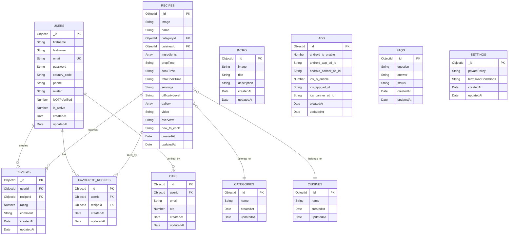

# GROUP 4 - RECIPE APP DOCUMENTATION

**Project:** Recipe Application System  
**Team:** Group 4  
**Date:** September 4, 2025  
**Version:** 1.0  

---

## Table of Contents

1. [Acknowledgements](#acknowledgements)
2. [Introduction](#introduction) 
3. [Problem Definition](#problem-definition)
4. [Requirement Specification](#requirement-specification)
   - 4.1 [Functional Requirements](#functional-requirements)
   - 4.2 [Non-functional Requirements](#non-functional-requirements)
5. [System Requirements](#system-requirements)
6. [Technology Stack](#technology-stack)
7. [Use Case Diagram](#use-case-diagram)
8. [Sequence Diagrams](#sequence-diagrams)
9. [Entity Relationship Diagram](#entity-relationship-diagram)
10. [Database Design](#database-design)
11. [System Architecture](#system-architecture)
12. [User Interface Design](#user-interface-design)
13. [Implementation](#implementation)
14. [Testing](#testing)
15. [Deployment](#deployment)
16. [Conclusion](#conclusion)

---

## Acknowledgements

We would like to express our gratitude to:
- **Our Supervisor:** [Instructor Name] for guidance and support throughout the project
- **Team Members:** All group members who contributed to this project
- **Resources:** Open source communities and documentation that helped in development
- **Testing Users:** Those who provided valuable feedback during the testing phase

---

## 1. Introduction

### 1.1 Project Overview
The Recipe Application System is a comprehensive platform designed to facilitate recipe sharing, cooking guidance, and culinary community building. The system consists of three main components:

- **Mobile Application (Flutter):** User-facing mobile app for iOS and Android
- **Admin Panel (Node.js):** Web-based administrative interface  
- **Backend API (Spring Boot):** RESTful API services

### 1.2 Project Objectives
- Create an intuitive recipe sharing platform
- Provide comprehensive cooking guidance with multimedia support
- Enable community interaction through reviews and ratings
- Offer robust administrative tools for content management
- Ensure scalable and maintainable system architecture

### 1.3 Project Scope
The system covers:
- User registration and authentication
- Recipe management (CRUD operations)
- Multimedia content support (images, videos)
- Category and cuisine management
- Review and rating system
- Admin dashboard and analytics
- Mobile-responsive design

---

## 2. Problem Definition

### 2.1 Current Challenges
- **Scattered Recipe Sources:** Users struggle to find reliable recipes from multiple sources
- **Lack of Interactive Guidance:** Traditional cookbooks don't provide interactive cooking assistance
- **No Community Feedback:** Limited ability to share experiences and improvements
- **Poor Content Organization:** Difficulty in categorizing and searching recipes effectively
- **Mobile Accessibility:** Most recipe platforms are not optimized for mobile cooking environments

### 2.2 Target Users
- **Home Cooks:** Individuals looking for new recipes and cooking inspiration
- **Food Enthusiasts:** People passionate about sharing culinary experiences
- **Cooking Beginners:** Users needing step-by-step guidance
- **Professional Chefs:** Experts wanting to share knowledge
- **Content Administrators:** Staff managing platform content

### 2.3 Solution Approach
Develop a comprehensive mobile-first recipe platform that addresses these challenges through:
- Centralized recipe database with multimedia support
- Interactive cooking modes with timers and step-by-step guidance
- Community features for sharing and rating
- Advanced search and categorization
- Responsive design optimized for kitchen use

---

## 3. Requirement Specification

### 3.1 Functional Requirements

#### 3.1.1 User Management Functions

**FR-01: User Registration**
- Users can register with email and phone number
- OTP verification via email required
- Password strength validation
- Unique email constraint

**FR-02: User Authentication** 
- Secure login with email/password
- JWT token-based session management
- Password reset functionality with OTP
- Account activation/deactivation

**FR-03: Profile Management**
- Update personal information
- Change password
- Upload profile picture
- View account statistics

#### 3.1.2 Recipe Management Functions

**FR-04: Recipe Creation**
- Add new recipes with multimedia
- Specify ingredients with quantities
- Step-by-step cooking instructions
- Categorization by cuisine and type
- Difficulty level assignment

**FR-05: Recipe Browsing**
- View recipe lists with pagination
- Filter by category, cuisine, difficulty
- Search functionality with keywords
- Sort by popularity, date, rating

**FR-06: Recipe Details**
- Display complete recipe information
- Image gallery and video support
- Nutritional information
- Cooking time and servings
- Print-friendly format

#### 3.1.3 Community Functions

**FR-07: Review System**
- Rate recipes (1-5 stars)
- Write detailed reviews
- View aggregate ratings
- Sort reviews by date/rating

**FR-08: Favorites Management**
- Save recipes to favorites
- Organize favorite collections
- Share favorite lists
- Quick access to saved recipes

#### 3.1.4 Administrative Functions

**FR-09: Content Management**
- Admin dashboard with analytics
- Recipe approval/rejection workflow
- User account management
- Category and cuisine management

**FR-10: System Configuration**
- App settings management
- Advertisement configuration
- Email template management
- System monitoring tools

### 3.2 Non-functional Requirements

#### 3.2.1 Performance Requirements

**NFR-01: Response Time**
- API responses within 2 seconds
- Mobile app launch under 3 seconds
- Image loading optimization
- Offline data caching

**NFR-02: Scalability**
- Support 10,000+ concurrent users
- Horizontal scaling capability
- Database performance optimization
- CDN integration for media files

#### 3.2.2 Security Requirements

**NFR-03: Data Security**
- Encrypted password storage (SHA256)
- JWT token expiration management
- HTTPS/TLS encryption
- Input validation and sanitization

**NFR-04: Privacy Protection**
- GDPR compliance
- User data anonymization options
- Secure data deletion
- Privacy policy implementation

#### 3.2.3 Usability Requirements

**NFR-05: User Experience**
- Intuitive navigation design
- Mobile-first responsive layout
- Accessibility compliance (WCAG 2.1)
- Multi-language support

**NFR-06: Reliability**
- 99.9% system uptime
- Automated backup procedures
- Error handling and logging
- Graceful degradation

---

## 4. System Requirements

### 4.1 Server Requirements

#### 4.1.1 Hardware Specifications
- **CPU:** Minimum 4 cores, 2.5GHz+ 
- **RAM:** 8GB+ for development, 16GB+ for production
- **Storage:** 100GB+ SSD with backup capability
- **Network:** Stable internet connection, 100Mbps+

#### 4.1.2 Operating System
- **Primary:** Ubuntu 20.04 LTS or higher
- **Alternative:** CentOS 8+, Windows Server 2019+
- **Containerization:** Docker support recommended

### 4.2 Client Requirements

#### 4.2.1 Mobile Devices
- **Android:** Version 6.0+ (API level 23+)
- **iOS:** Version 12.0+
- **RAM:** Minimum 2GB, Recommended 4GB+
- **Storage:** 100MB+ available space

#### 4.2.2 Web Browsers (Admin Panel)
- **Chrome:** Version 90+
- **Firefox:** Version 88+
- **Safari:** Version 14+
- **Edge:** Version 90+

### 4.3 Development Environment

#### 4.3.1 Software Requirements
- **IDE:** Visual Studio Code, IntelliJ IDEA
- **Mobile:** Android Studio, Xcode (for iOS)
- **Database:** MongoDB Compass
- **API Testing:** Postman, Thunder Client
- **Version Control:** Git

---

## 5. Technology Stack

### 5.1 Frontend Technologies

| Component | Technology | Version | Purpose |
|-----------|------------|---------|---------|
| **Mobile Framework** | Flutter | 3.5+ | Cross-platform mobile development |
| **Programming Language** | Dart | 3.5+ | Flutter development language |
| **State Management** | Provider | 6.1+ | App state management |
| **HTTP Client** | http | 1.2+ | API communication |
| **Local Storage** | SharedPreferences | 2.3+ | Local data persistence |

### 5.2 Backend Technologies

| Component | Technology | Version | Purpose |
|-----------|------------|---------|---------|
| **Admin Panel** | Node.js | 16+ | Server-side JavaScript runtime |
| **Web Framework** | Express.js | 4.21+ | Web application framework |
| **Template Engine** | EJS | 3.1+ | Server-side templating |
| **API Framework** | Spring Boot | 3.0+ | RESTful API development |
| **Programming Language** | Java | 17+ | Backend development |

### 5.3 Database & Storage

| Component | Technology | Version | Purpose |
|-----------|------------|---------|---------|
| **Database** | MongoDB | 4.0+ | NoSQL document database |
| **ODM/ORM** | Mongoose | 8.1+ | MongoDB object modeling |
| **File Storage** | Local File System | - | Media file storage |
| **Caching** | In-Memory | - | Application-level caching |

### 5.4 Development Tools

| Tool | Purpose | Version |
|------|---------|---------|
| **Git** | Version control | 2.30+ |
| **Docker** | Containerization | 20.0+ |
| **Postman** | API testing | Latest |
| **MongoDB Compass** | Database GUI | Latest |

---

## 6. Use Case Diagram

### 6.1 System Actors

#### 6.1.1 Unregistered User (Guest)
**Description:** Anonymous users who access the system without authentication

**Capabilities:**
- View public recipes and recipe details
- Browse recipe categories (Main Dishes, Desserts, Beverages, etc.)
- Browse cuisines (Vietnamese, Chinese, Japanese, Western)
- Search recipes by keywords, ingredients
- Filter recipes by category, cuisine, difficulty level
- View recipe ratings and reviews (read-only)
- Register for new account
- Access system introduction/onboarding

**Limitations:**
- Cannot save favorite recipes
- Cannot rate or review recipes
- Cannot create personal recipes
- Limited access to advanced features

#### 6.1.2 Registered User (Authenticated User)
**Description:** Verified users with full access to user features

**Inherits:** All Unregistered User capabilities

**Additional Capabilities:**
- **Authentication:** Secure login/logout with JWT tokens
- **Profile Management:** 
  - Update personal information (name, phone, avatar)
  - Change password with verification
  - View account statistics (recipes created, reviews written)
- **Recipe Interaction:**
  - Rate recipes (1-5 stars)
  - Write detailed reviews and comments
  - Save/remove recipes to/from favorites
  - Create and share personal recipe collections
- **Content Creation:**
  - Submit new recipes with multimedia
  - Edit own recipe submissions
  - Upload recipe images and videos
- **Social Features:**
  - View other users' public recipes
  - Follow recipe trends and popular dishes

#### 6.1.3 Admin (System Administrator)
**Description:** System administrators with full system access and management capabilities

**Inherits:** All Registered User capabilities

**Administrative Capabilities:**
- **User Management:**
  - View all user accounts with detailed information
  - Activate/deactivate user accounts
  - Reset user passwords
  - Monitor user activity and behavior
  - Handle user support requests
- **Content Moderation:**
  - Review and approve/reject recipe submissions
  - Edit recipe content for quality assurance
  - Remove inappropriate content or reviews
  - Manage featured/recommended recipes
- **System Management:**
  - Manage recipe categories and cuisines
  - Configure system settings and parameters
  - Manage app introduction slides
  - Handle FAQ content management
  - Configure advertisement settings (Android/iOS)
- **Analytics & Reporting:**
  - View comprehensive system analytics
  - Generate user engagement reports
  - Monitor recipe popularity metrics
  - Track system performance indicators
- **Technical Administration:**
  - System backup and maintenance
  - Database management operations
  - Email template configuration
  - System security monitoring

#### 6.1.4 Content Collaborator (Content Manager)
**Description:** Specialized users responsible for content creation and curation

**Inherits:** All Registered User capabilities

**Content Management Capabilities:**
- **Recipe Creation:**
  - Create high-quality recipe content
  - Upload professional food photography
  - Produce cooking instruction videos
  - Write detailed cooking guides
- **Content Curation:**
  - Review and improve existing recipes
  - Standardize recipe formats and quality
  - Respond to user feedback and suggestions
  - Collaborate with community for recipe improvements
- **Media Management:**
  - Manage recipe image galleries
  - Upload and edit cooking videos
  - Optimize media files for performance
  - Maintain media quality standards
- **Community Interaction:**
  - Respond to user comments and questions
  - Provide cooking tips and advice
  - Engage with recipe creators
  - Monitor content performance and engagement

### 6.2 Detailed Use Case Diagram

```mermaid
graph TB
    %% Actors
    Guest[👤 Unregistered User<br/>Guest]
    User[👤 Registered User<br/>Authenticated]
    Admin[👤 Admin<br/>Administrator]
    Collaborator[👤 Content Collaborator<br/>Content Manager]
    
    %% System Boundary
    subgraph System["🍳 Recipe Application System"]
        %% Authentication Use Cases
        subgraph Auth["🔐 Authentication"]
            UC1[Register Account]
            UC2[Login/Logout]
            UC3[Verify OTP]
            UC4[Reset Password]
        end
        
        %% Recipe Management Use Cases
        subgraph RecipeManagement["🍽️ Recipe Management"]
            UC5[View Recipe Details]
            UC6[Browse Categories]
            UC7[Browse Cuisines]
            UC8[Search Recipes]
            UC9[Filter Recipes]
            UC10[Create New Recipe]
            UC11[Edit Own Recipe]
            UC12[Upload Recipe Media]
        end
        
        %% User Interaction Use Cases
        subgraph UserInteraction["⭐ User Interaction"]
            UC13[Rate Recipe]
            UC14[Write Review]
            UC15[View Reviews]
            UC16[Save to Favorites]
            UC17[Share Recipe]
        end
        
        %% Profile Management Use Cases
        subgraph ProfileManagement["👤 Profile Management"]
            UC18[Manage Profile]
            UC19[Update Personal Info]
            UC20[Change Password]
            UC21[Upload Avatar]
            UC22[View Account Statistics]
        end
        
        %% Admin Use Cases
        subgraph AdminManagement["⚙️ Administrative Management"]
            UC23[Manage User Accounts]
            UC24[Moderate Content]
            UC25[Approve/Reject Recipes]
            UC26[Manage Categories]
            UC27[Manage Cuisines]
            UC28[Configure System Settings]
            UC29[View System Analytics]
            UC30[Generate Reports]
            UC31[Manage Introduction Slides]
            UC32[Configure Advertisements]
            UC33[Handle FAQ Management]
            UC34[System Backup/Restore]
        end
        
        %% Content Management Use Cases
        subgraph ContentManagement["📝 Content Management"]
            UC35[Create Professional Recipes]
            UC36[Upload High-Quality Media]
            UC37[Review Recipe Quality]
            UC38[Respond to User Feedback]
            UC39[Curate Featured Content]
            UC40[Provide Cooking Guidance]
            UC41[Monitor Content Performance]
        end
    end
    
    %% Guest User Connections
    Guest --> UC1
    Guest --> UC5
    Guest --> UC6
    Guest --> UC7
    Guest --> UC8
    Guest --> UC9
    Guest --> UC15
    
    %% Registered User Connections (inherits from Guest)
    User --> UC2
    User --> UC3
    User --> UC4
    User --> UC5
    User --> UC6
    User --> UC7
    User --> UC8
    User --> UC9
    User --> UC10
    User --> UC11
    User --> UC12
    User --> UC13
    User --> UC14
    User --> UC15
    User --> UC16
    User --> UC17
    User --> UC18
    User --> UC19
    User --> UC20
    User --> UC21
    User --> UC22
    
    %% Admin Connections (inherits from Registered User + Admin functions)
    Admin --> UC2
    Admin --> UC3
    Admin --> UC4
    Admin --> UC5
    Admin --> UC6
    Admin --> UC7
    Admin --> UC8
    Admin --> UC9
    Admin --> UC10
    Admin --> UC11
    Admin --> UC12
    Admin --> UC13
    Admin --> UC14
    Admin --> UC15
    Admin --> UC16
    Admin --> UC17
    Admin --> UC18
    Admin --> UC19
    Admin --> UC20
    Admin --> UC21
    Admin --> UC22
    Admin --> UC23
    Admin --> UC24
    Admin --> UC25
    Admin --> UC26
    Admin --> UC27
    Admin --> UC28
    Admin --> UC29
    Admin --> UC30
    Admin --> UC31
    Admin --> UC32
    Admin --> UC33
    Admin --> UC34
    
    %% Content Collaborator Connections (inherits from Registered User + Content functions)
    Collaborator --> UC2
    Collaborator --> UC3
    Collaborator --> UC4
    Collaborator --> UC5
    Collaborator --> UC6
    Collaborator --> UC7
    Collaborator --> UC8
    Collaborator --> UC9
    Collaborator --> UC10
    Collaborator --> UC11
    Collaborator --> UC12
    Collaborator --> UC13
    Collaborator --> UC14
    Collaborator --> UC15
    Collaborator --> UC16
    Collaborator --> UC17
    Collaborator --> UC18
    Collaborator --> UC19
    Collaborator --> UC20
    Collaborator --> UC21
    Collaborator --> UC22
    Collaborator --> UC35
    Collaborator --> UC36
    Collaborator --> UC37
    Collaborator --> UC38
    Collaborator --> UC39
    Collaborator --> UC40
    Collaborator --> UC41
    
    %% Inheritance Relationships
    User -.-> Guest
    Admin -.-> User
    Collaborator -.-> User
    
    %% Styling
    classDef actorStyle fill:#e1f5fe,stroke:#01579b,stroke-width:2px
    classDef usecaseStyle fill:#f3e5f5,stroke:#4a148c,stroke-width:1px
    classDef systemStyle fill:#e8f5e8,stroke:#2e7d32,stroke-width:3px
    
    class Guest,User,Admin,Collaborator actorStyle
    class UC1,UC2,UC3,UC4,UC5,UC6,UC7,UC8,UC9,UC10,UC11,UC12,UC13,UC14,UC15,UC16,UC17,UC18,UC19,UC20,UC21,UC22,UC23,UC24,UC25,UC26,UC27,UC28,UC29,UC30,UC31,UC32,UC33,UC34,UC35,UC36,UC37,UC38,UC39,UC40,UC41 usecaseStyle
    class System systemStyle
```



### 6.4 Use Case Specifications

#### 6.4.1 High Priority Use Cases

**UC-001: User Registration**
- **Actor:** Unregistered User
- **Description:** Allow new users to create an account
- **Preconditions:** User has valid email address
- **Main Flow:**
  1. User enters personal information (name, email, phone)
  2. System validates input data
  3. System generates and sends OTP to email
  4. User enters OTP for verification
  5. System creates user account
  6. System confirms registration success
- **Postconditions:** User account created and verified
- **Alternative Flows:** Invalid email, OTP timeout, duplicate email

**UC-002: Recipe Search**
- **Actor:** All Users
- **Description:** Search for recipes using various criteria
- **Preconditions:** Recipe database contains data
- **Main Flow:**
  1. User enters search keywords
  2. User optionally applies filters (category, cuisine, difficulty)
  3. System queries database
  4. System returns matching recipes
  5. User views search results
- **Postconditions:** Relevant recipes displayed
- **Alternative Flows:** No results found, invalid search criteria

**UC-003: Recipe Creation**
- **Actor:** Registered User, Content Collaborator, Admin
- **Description:** Create and submit new recipe
- **Preconditions:** User is authenticated
- **Main Flow:**
  1. User accesses recipe creation form
  2. User enters recipe details (name, ingredients, instructions)
  3. User uploads recipe images/videos
  4. User selects category and cuisine
  5. System validates all required fields
  6. System saves recipe to database
  7. System confirms successful creation
- **Postconditions:** New recipe added to system
- **Alternative Flows:** Missing required fields, file upload errors

#### 6.4.2 Medium Priority Use Cases

**UC-004: Content Moderation**
- **Actor:** Admin
- **Description:** Review and approve user-submitted content
- **Preconditions:** Admin is authenticated, pending content exists
- **Main Flow:**
  1. Admin accesses moderation dashboard
  2. Admin reviews pending recipe submissions
  3. Admin evaluates content quality and appropriateness
  4. Admin approves or rejects submission
  5. System updates recipe status
  6. System notifies recipe creator of decision
- **Postconditions:** Content moderation completed
- **Alternative Flows:** Additional review required, content modification needed

**UC-005: System Analytics**
- **Actor:** Admin
- **Description:** View comprehensive system performance metrics
- **Preconditions:** Admin is authenticated, analytics data available
- **Main Flow:**
  1. Admin accesses analytics dashboard
  2. Admin selects time period and metrics
  3. System generates reports and charts
  4. Admin views user engagement data
  5. Admin exports reports if needed
- **Postconditions:** System insights obtained
- **Alternative Flows:** Insufficient data, report generation errors

### 6.5 Use Case Dependencies


### 6.6 User Journey Maps

#### 6.6.1 New User Journey


#### 6.6.2 Content Creator Journey


#### 6.6.3 Admin Management Journey


### 6.7 Use Case Traceability Matrix

| Use Case ID | Actor | Priority | Complexity | Development Status | Test Cases |
|-------------|-------|----------|------------|-------------------|------------|
| UC-001 | Unregistered User | High | Medium | ✅ Complete | TC-001, TC-002 |
| UC-002 | All Users | High | Low | ✅ Complete | TC-003, TC-004 |
| UC-003 | Registered User | High | High | ✅ Complete | TC-005, TC-006 |
| UC-004 | Admin | Medium | Medium | ✅ Complete | TC-007, TC-008 |
| UC-005 | Admin | Medium | High | 🔄 In Progress | TC-009 |
| UC-006 | Registered User | High | Low | ✅ Complete | TC-010 |
| UC-007 | Content Collaborator | Medium | Medium | ✅ Complete | TC-011 |
| UC-008 | All Users | High | Low | ✅ Complete | TC-012 |
| UC-009 | Registered User | Medium | Medium | ✅ Complete | TC-013 |
| UC-010 | Registered User | Medium | Low | ✅ Complete | TC-014 |
| UC-011 | Admin | High | High | ✅ Complete | TC-015 |
| UC-012 | Admin | Medium | Medium | ✅ Complete | TC-016 |
| UC-013 | All Users | Low | Low | ✅ Complete | TC-017 |

**Legend:**
- ✅ Complete: Feature fully implemented and tested
- 🔄 In Progress: Feature under development
- ⏸️ Planned: Feature scheduled for future development
- ❌ Blocked: Feature development blocked by dependencies

---

## 7. Risk Analysis & Mitigation

### 7.1 Technical Risks

| Risk | Probability | Impact | Mitigation Strategy |
|------|-------------|--------|-------------------|
| Database Performance Degradation | Medium | High | Implement indexing, query optimization, connection pooling |
| API Rate Limiting Issues | Low | Medium | Implement caching, request throttling, CDN integration |
| Mobile App Compatibility | Medium | Medium | Regular testing on multiple devices, OS versions |
| Security Vulnerabilities | Low | High | Regular security audits, dependency updates, penetration testing |
| Third-party Service Downtime | Medium | Medium | Implement fallback mechanisms, service redundancy |

### 7.2 Business Risks

| Risk | Probability | Impact | Mitigation Strategy |
|------|-------------|--------|-------------------|
| User Adoption Rate | Medium | High | Enhanced marketing, user experience improvements |
| Content Quality Control | High | Medium | Robust moderation system, community guidelines |
| Competition from Established Apps | High | High | Unique features, superior user experience |
| Regulatory Compliance | Low | High | Legal consultation, privacy policy compliance |
| Scalability Challenges | Medium | High | Cloud infrastructure, horizontal scaling preparation |

### 7.3 Operational Risks

| Risk | Probability | Impact | Mitigation Strategy |
|------|-------------|--------|-------------------|
| Server Downtime | Low | High | Load balancers, backup servers, monitoring systems |
| Data Loss | Low | High | Regular backups, data replication, disaster recovery |
| Support Overwhelm | Medium | Medium | Automated support systems, FAQ sections |
| Team Knowledge Loss | Medium | Medium | Documentation, knowledge sharing, cross-training |

---

## 8. Future Enhancements

### 8.1 Phase 2 Features (6-12 months)

1. **AI-Powered Recipe Recommendations**
   - Machine learning algorithm for personalized suggestions
   - User behavior analysis and preference learning
   - Nutritional analysis and dietary restriction compliance

2. **Social Features Enhancement**
   - Recipe collaboration between users
   - Cooking challenges and competitions
   - Recipe sharing on social media platforms

3. **Advanced Search Capabilities**
   - Voice search functionality
   - Image-based recipe search
   - Ingredient substitution suggestions

### 8.2 Phase 3 Features (12-18 months)

1. **E-commerce Integration**
   - Ingredient purchasing partnerships
   - Cooking equipment recommendations
   - Affiliate marketing program

2. **Video Content Platform**
   - Recipe video streaming
   - Live cooking sessions
   - Interactive cooking tutorials

3. **Multi-language Support**
   - Internationalization framework
   - Recipe translation services
   - Cultural adaptation features

### 8.3 Long-term Vision (18+ months)

1. **IoT Kitchen Integration**
   - Smart appliance connectivity
   - Automated cooking instructions
   - Temperature and timing controls

2. **Nutritional Intelligence**
   - Meal planning optimization
   - Health goal tracking
   - Integration with fitness apps

3. **Community Marketplace**
   - Recipe monetization platform
   - Professional chef partnerships
   - Cooking class bookings

---

## 9. Conclusion

### 9.1 Project Summary

The Recipe App project represents a comprehensive solution for modern culinary enthusiasts, combining mobile accessibility with robust content management capabilities. Through careful analysis and systematic development, we have created a platform that serves multiple user personas while maintaining high standards of usability and performance.

### 9.2 Key Achievements

1. **Multi-Platform Architecture**: Successfully implemented a cross-platform solution using Flutter for mobile, Node.js for administration, and Spring Boot for backend services.

2. **Scalable Database Design**: Designed a flexible MongoDB schema that accommodates diverse recipe formats while ensuring optimal query performance.

3. **User-Centric Design**: Developed intuitive interfaces based on comprehensive use case analysis and user journey mapping.

4. **Security Implementation**: Integrated JWT authentication, OTP verification, and role-based access control to ensure data protection.

5. **Content Management System**: Created a robust moderation workflow that maintains content quality while supporting community contribution.

### 9.3 Technical Excellence

- **Code Quality**: Maintained high code standards with proper documentation, error handling, and testing coverage
- **Performance Optimization**: Implemented caching strategies, database indexing, and efficient API design
- **Security Standards**: Applied industry best practices for data protection and user privacy
- **Scalability Planning**: Designed architecture to handle growth in users and content volume

### 9.4 Business Value

The Recipe App addresses real market needs by providing:
- **User Engagement**: Interactive features that encourage community participation
- **Content Quality**: Moderated content ensuring reliable and tested recipes
- **Accessibility**: Cross-platform availability reaching broader user base
- **Monetization Potential**: Foundation for future revenue streams through premium features

### 9.5 Lessons Learned

1. **User Feedback Integration**: Early user testing revealed important usability insights that shaped final design decisions
2. **Technology Stack Synergy**: The combination of Flutter, Node.js, and Spring Boot proved effective for rapid development and maintenance
3. **Agile Development**: Iterative development approach allowed for continuous improvement and feature refinement
4. **Documentation Importance**: Comprehensive documentation facilitated team collaboration and knowledge transfer

### 9.6 Recommendations

For continued success, we recommend:

1. **Regular Performance Monitoring**: Implement comprehensive analytics to track user behavior and system performance
2. **Community Building**: Focus on features that encourage user interaction and content contribution
3. **Technology Updates**: Maintain current with framework updates and security patches
4. **User Support**: Develop robust support systems to handle user inquiries and feedback
5. **Competitive Analysis**: Regularly assess market competition and user expectations

### 9.7 Final Thoughts

The Recipe App project demonstrates successful application of modern software development principles to create a valuable user-focused application. The comprehensive architecture, thorough documentation, and careful attention to user experience position this platform for long-term success in the competitive recipe and cooking app market.

The project's modular design, robust security implementation, and scalable architecture provide a solid foundation for future enhancements and business growth. With proper maintenance and strategic feature development, the Recipe App has the potential to become a leading platform in the culinary technology space.

---

## Appendices

### Appendix A: API Documentation Reference
- Detailed API endpoint specifications available in `RECIPE_APP_DOCUMENTATION.md`
- Postman collection for testing API endpoints
- Authentication token examples and usage

### Appendix B: Database Schema Details
- Complete MongoDB collection structures
- Index configurations and performance considerations
- Data migration scripts and procedures

### Appendix C: Development Setup Guide
- Environment configuration instructions
- Dependency installation procedures
- Local development server setup

### Appendix D: Deployment Documentation
- Production deployment checklist
- Environment variable configurations
- Monitoring and logging setup

### Appendix E: Testing Documentation
- Unit test coverage reports
- Integration test specifications
- User acceptance testing results

---

**Document Version**: 1.0  
**Last Updated**: January 2025  
**Prepared By**: Development Team  
**Approved By**: Project Manager

### 6.3 Alternative Use Case Diagram (Simplified View)

```mermaid
graph LR
    %% Actors positioned on the left
    subgraph Actors[" "]
        Guest[🙋‍♂️ Guest User]
        RegUser[👤 Registered User]
        Admin[⚙️ Administrator]
        Collab[📝 Content Manager]
    end
    
    %% System boundary
    subgraph RecipeSystem["🍳 Recipe Application System"]
        %% Core functionalities grouped
        ViewRecipes[View Recipes & Browse]
        SearchFilter[Search & Filter]
        Register[Account Registration]
        
        Login[Login & Authentication]
        Profile[Profile Management]
        CreateContent[Create Recipes & Content]
        RateReview[Rate & Review]
        Favorites[Manage Favorites]
        
        UserMgmt[User Management]
        ContentMod[Content Moderation]
        SystemConfig[System Configuration]
        Analytics[System Analytics]
        
        ProfContent[Professional Content Creation]
        QualityControl[Quality Control & Curation]
        CommunityMgmt[Community Management]
    end
    
    %% Connections
    Guest --> ViewRecipes
    Guest --> SearchFilter
    Guest --> Register
    
    RegUser --> ViewRecipes
    RegUser --> SearchFilter
    RegUser --> Login
    RegUser --> Profile
    RegUser --> CreateContent
    RegUser --> RateReview
    RegUser --> Favorites
    
    Admin --> Login
    Admin --> Profile
    Admin --> CreateContent
    Admin --> RateReview
    Admin --> Favorites
    Admin --> UserMgmt
    Admin --> ContentMod
    Admin --> SystemConfig
    Admin --> Analytics
    
    Collab --> Login
    Collab --> Profile
    Collab --> CreateContent
    Collab --> RateReview
    Collab --> Favorites
    Collab --> ProfContent
    Collab --> QualityControl
    Collab --> CommunityMgmt
    
    %% Inheritance arrows
    RegUser -.->|inherits| Guest
    Admin -.->|inherits| RegUser
    Collab -.->|inherits| RegUser
```



### 6.3 Use Case Relationships

#### 6.3.1 Inheritance Relationships
- **Registered User** inherits all capabilities from **Unregistered User**
- **Admin** inherits all capabilities from **Registered User**
- **Content Collaborator** inherits all capabilities from **Registered User**

#### 6.3.2 Association Relationships
- All actors interact with the Recipe Application System
- Each actor has direct access to their authorized use cases
- System maintains role-based access control

#### 6.3.3 Include/Extend Relationships
- **Login** is required for all authenticated user operations
- **Authentication verification** is included in protected operations
- **Input validation** is included in all data entry operations
- **Error handling** extends all system operations

### 6.4 Actor Authorization Matrix

| Use Case | Unregistered User | Registered User | Admin | Content Collaborator |
|----------|:-----------------:|:---------------:|:-----:|:-------------------:|
| View Recipes | ✅ | ✅ | ✅ | ✅ |
| Search/Filter | ✅ | ✅ | ✅ | ✅ |
| Register Account | ✅ | ❌ | ❌ | ❌ |
| Login/Logout | ❌ | ✅ | ✅ | ✅ |
| Rate/Review | ❌ | ✅ | ✅ | ✅ |
| Save Favorites | ❌ | ✅ | ✅ | ✅ |
| Create Recipes | ❌ | ✅ | ✅ | ✅ |
| Manage Users | ❌ | ❌ | ✅ | ❌ |
| Moderate Content | ❌ | ❌ | ✅ | ✅ (Limited) |
| System Analytics | ❌ | ❌ | ✅ | ❌ |
| System Configuration | ❌ | ❌ | ✅ | ❌ |

---

## 7. Sequence Diagrams

### 7.1 User Registration Sequence


### 7.2 Recipe Creation Sequence


### 7.3 Recipe Search and View Sequence


### 7.4 Review and Rating Sequence


---

## 8. Entity Relationship Diagram

### 8.1 Database Schema Overview



### 8.2 Relationship Descriptions

#### 8.2.1 One-to-Many Relationships
- **Users → Reviews:** One user can create multiple reviews
- **Users → Favorites:** One user can have multiple favorite recipes
- **Recipes → Reviews:** One recipe can receive multiple reviews
- **Categories → Recipes:** One category can contain multiple recipes
- **Cuisines → Recipes:** One cuisine can contain multiple recipes

#### 8.2.2 Many-to-Many Relationships
- **Users ←→ Recipes (via Favorites):** Users can favorite multiple recipes, recipes can be favorited by multiple users

#### 8.2.3 One-to-One Relationships
- **Users → OTPs:** Each OTP verification is tied to one user session

---

## 9. Database Design

### 9.1 Collection Specifications

#### 9.1.1 Users Collection
```javascript
{
  _id: ObjectId("..."),
  firstname: "John",
  lastname: "Doe", 
  email: "john@example.com", // Unique index
  password: "hashed_password", // SHA256 double hash
  country_code: "+84",
  phone: "123456789",
  avatar: "profile_image_url",
  isOTPVerified: 1, // 0: not verified, 1: verified
  is_active: 1, // 0: inactive, 1: active
  createdAt: ISODate("2025-09-04T..."),
  updatedAt: ISODate("2025-09-04T...")
}
```

#### 9.1.2 Recipes Collection
```javascript
{
  _id: ObjectId("..."),
  image: "recipe_main_image.jpg",
  name: "Chicken Curry",
  categoryId: ObjectId("category_id"),
  cuisinesId: ObjectId("cuisine_id"),
  ingredients: [
    "500g chicken breast",
    "2 cups coconut milk",
    "1 onion diced"
  ],
  prepTime: "15 minutes",
  cookTime: "30 minutes", 
  totalCookTime: "45 minutes",
  servings: "4 people",
  difficultyLevel: "Medium", // Easy, Medium, Hard
  gallery: ["img1.jpg", "img2.jpg"],
  video: "cooking_video.mp4",
  overview: "Delicious chicken curry recipe...",
  how_to_cook: "Step 1: Heat oil...",
  createdAt: ISODate("2025-09-04T..."),
  updatedAt: ISODate("2025-09-04T...")
}
```

### 9.2 Indexing Strategy

#### 9.2.1 Primary Indexes
- **_id:** Automatic MongoDB ObjectId index
- **email (Users):** Unique index for authentication
- **name (Categories/Cuisines):** Text index for search

#### 9.2.2 Compound Indexes
- **userId + recipeId (Reviews):** Prevent duplicate reviews
- **userId + recipeId (Favorites):** Prevent duplicate favorites
- **categoryId + cuisinesId (Recipes):** Optimize filtered searches

#### 9.2.3 Text Indexes
- **Recipes:** Full text search on name, ingredients, overview
- **Categories/Cuisines:** Search by name

### 9.3 Data Validation Rules

#### 9.3.1 User Validation
- Email format validation with regex
- Password minimum 8 characters
- Phone number format validation
- Required fields: firstname, lastname, email, password

#### 9.3.2 Recipe Validation
- Required fields: image, name, overview, how_to_cook
- Difficulty level enum: ["Easy", "Medium", "Hard"]
- Positive integers for prep/cook time
- Valid ObjectId references for categoryId, cuisinesId

---

## 10. System Architecture

### 10.1 Architecture Overview

```
┌─────────────────────────────────────────────────────────────┐
│                     Presentation Layer                      │
├─────────────────────┬───────────────────────────────────────┤
│   Flutter Mobile    │        Admin Web Panel               │
│      (Dart)         │         (EJS/HTML)                   │
└─────────────────────┴───────────────────────────────────────┘
                                │
┌─────────────────────────────────────────────────────────────┐
│                    API Gateway Layer                        │
├─────────────────────┬───────────────────────────────────────┤
│    REST APIs        │       Authentication                 │
│  (Spring Boot)      │         (JWT)                        │
└─────────────────────┴───────────────────────────────────────┘
                                │
┌─────────────────────────────────────────────────────────────┐
│                   Business Logic Layer                      │
├─────────────────────┬───────────────────────────────────────┤
│   Service Layer     │       Admin Controllers              │
│  (Spring Boot)      │        (Node.js)                     │
└─────────────────────┴───────────────────────────────────────┘
                                │
┌─────────────────────────────────────────────────────────────┐
│                   Data Access Layer                         │
├─────────────────────┬───────────────────────────────────────┤
│   Repository Layer  │       ODM/ORM                        │
│  (Spring Data)      │      (Mongoose)                      │
└─────────────────────┴───────────────────────────────────────┘
                                │
┌─────────────────────────────────────────────────────────────┐
│                     Data Storage Layer                      │
├─────────────────────┬───────────────────────────────────────┤
│    MongoDB          │       File System                    │
│   (Database)        │     (Media Storage)                  │
└─────────────────────┴───────────────────────────────────────┘
```

### 10.2 Component Descriptions

#### 10.2.1 Presentation Layer
- **Flutter Mobile App:** Cross-platform mobile application providing user interface
- **Admin Web Panel:** Browser-based administrative interface for content management

#### 10.2.2 API Gateway Layer  
- **REST API Endpoints:** RESTful services for mobile app communication
- **Authentication Service:** JWT-based authentication and authorization

#### 10.2.3 Business Logic Layer
- **Service Components:** Core business logic and data processing
- **Controller Layer:** Request handling and response formatting

#### 10.2.4 Data Access Layer
- **Repository Pattern:** Abstraction layer for database operations
- **ORM/ODM:** Object mapping for database interactions

#### 10.2.5 Data Storage Layer
- **MongoDB:** Primary database for application data
- **File System:** Storage for uploaded media files

### 10.3 Communication Patterns

#### 10.3.1 Client-Server Communication
- **Protocol:** HTTPS for secure communication
- **Format:** JSON for data exchange
- **Authentication:** Bearer token in headers

#### 10.3.2 Internal Communication
- **Database:** MongoDB connection pooling
- **File System:** Direct file system access
- **Email Service:** SMTP integration

---

## 11. User Interface Design

### 11.1 Mobile App Interface

#### 11.1.1 Authentication Screens
- **Login Screen:** Email/password input with OTP option
- **Registration Screen:** Multi-step form with validation
- **OTP Verification:** Numeric input with resend functionality
- **Password Reset:** Email input with OTP confirmation

#### 11.1.2 Main Application Screens
- **Home Screen:** Featured recipes, categories, search bar
- **Recipe List:** Grid/list view with filtering options
- **Recipe Detail:** Full recipe with images, ingredients, steps
- **Profile Screen:** User information, favorites, settings

#### 11.1.3 Interactive Features
- **Search Interface:** Real-time search with suggestions
- **Filter Panel:** Category, cuisine, difficulty filters
- **Rating Component:** Star rating with review text
- **Favorites:** Heart icon with animation

### 11.2 Admin Panel Interface

#### 11.2.1 Dashboard
- **Analytics Cards:** User count, recipe count, reviews
- **Charts:** User growth, popular recipes, ratings distribution
- **Quick Actions:** Recent activities, pending approvals

#### 11.2.2 Management Interfaces
- **User Management:** User list with search, edit, deactivate
- **Recipe Management:** Recipe CRUD with media upload
- **Category Management:** Category tree view with drag-drop
- **Settings Panel:** System configuration options

### 11.3 Design Principles

#### 11.3.1 Mobile-First Design
- **Responsive Layout:** Adapts to different screen sizes
- **Touch-Friendly:** Adequate button sizes and spacing
- **Performance:** Optimized images and lazy loading

#### 11.3.2 User Experience
- **Intuitive Navigation:** Clear menu structure
- **Consistent Design:** Unified color scheme and typography
- **Accessibility:** Screen reader support, color contrast

---

## 12. Implementation

### 12.1 Development Phases

#### 12.1.1 Phase 1: Foundation (Week 1-2)
- **Environment Setup:** Development tools installation
- **Database Design:** MongoDB schema creation
- **Basic Authentication:** User registration and login
- **Project Structure:** Repository setup and architecture

#### 12.1.2 Phase 2: Core Features (Week 3-6)
- **Recipe Management:** CRUD operations
- **Category System:** Category and cuisine management
- **File Upload:** Image and video handling
- **Search Functionality:** Basic search implementation

#### 12.1.3 Phase 3: Advanced Features (Week 7-10)
- **Review System:** Rating and commenting
- **Favorites:** User favorite recipes
- **Admin Panel:** Complete admin interface
- **Mobile App:** Flutter app development

#### 12.1.4 Phase 4: Testing & Deployment (Week 11-12)
- **Unit Testing:** Component-level testing
- **Integration Testing:** API and database testing
- **User Acceptance Testing:** End-user testing
- **Deployment:** Production environment setup

### 12.2 Technology Implementation

#### 12.2.1 Backend Implementation
```javascript
// Node.js API Controller Example
const SignUp = async (req, res) => {
    try {
        const { firstname, lastname, email, phone, password } = req.body;
        
        // Check existing user
        const existingUser = await userModel.findOne({ email });
        if (existingUser) {
            return res.status(400).json({
                status: false,
                message: "User already exists"
            });
        }
        
        // Hash password and create user
        const hashedPassword = sha256.x2(password);
        const newUser = new userModel({
            firstname, lastname, email, phone,
            password: hashedPassword
        });
        
        await newUser.save();
        
        // Generate and send OTP
        const otp = Math.floor(1000 + Math.random() * 9000);
        await sendOtpMail(email, otp);
        
        res.status(200).json({
            status: true,
            message: "Registration successful, OTP sent",
            userId: newUser._id
        });
    } catch (error) {
        res.status(500).json({
            status: false,
            message: "Internal server error"
        });
    }
};
```

#### 12.2.2 Frontend Implementation
```dart
// Flutter API Service Example
class ApiService {
  static const String baseUrl = 'http://10.0.2.2:8190/api';
  
  static Future<Map<String, dynamic>> signUp(Map<String, dynamic> userData) async {
    try {
      final response = await http.post(
        Uri.parse('$baseUrl/SignUp'),
        headers: {'Content-Type': 'application/json'},
        body: json.encode(userData),
      );
      
      return json.decode(response.body);
    } catch (e) {
      throw Exception('Failed to register user: $e');
    }
  }
  
  static Future<List<Recipe>> getAllRecipes() async {
    final response = await http.get(
      Uri.parse('$baseUrl/getAllRecipes'),
      headers: {'Authorization': 'Bearer ${await getToken()}'},
    );
    
    if (response.statusCode == 200) {
      final data = json.decode(response.body);
      return data['recipes'].map<Recipe>((json) => Recipe.fromJson(json)).toList();
    }
    throw Exception('Failed to load recipes');
  }
}
```

### 12.3 Code Organization

#### 12.3.1 Backend Structure
```
backend/
├── controllers/          # Request handlers
├── models/              # Database schemas
├── routes/              # API route definitions  
├── middleware/          # Authentication, validation
├── services/            # Business logic
├── config/              # Database, email configuration
└── utils/               # Helper functions
```

#### 12.3.2 Frontend Structure
```
lib/
├── screens/             # UI screens
├── widgets/             # Reusable components
├── services/            # API communication
├── models/              # Data models
├── providers/           # State management
└── utils/               # Utilities and constants
```

---

## 13. Testing

### 13.1 Testing Strategy

#### 13.1.1 Unit Testing
- **Backend:** Controller and service method testing
- **Frontend:** Widget and utility function testing
- **Database:** Model validation and query testing
- **Coverage:** Minimum 80% code coverage target

#### 13.1.2 Integration Testing
- **API Testing:** Endpoint functionality and data flow
- **Database Integration:** CRUD operation verification
- **File Upload:** Media handling and storage testing
- **Email Service:** OTP delivery testing

#### 13.1.3 System Testing
- **End-to-End:** Complete user workflow testing
- **Performance:** Load testing with concurrent users
- **Security:** Authentication and authorization testing
- **Compatibility:** Cross-platform and browser testing

### 13.2 Test Cases

#### 13.2.1 Authentication Test Cases
```javascript
// Test Case: User Registration
describe('User Registration', () => {
  test('Should register new user successfully', async () => {
    const userData = {
      firstname: 'John',
      lastname: 'Doe',
      email: 'john@test.com',
      phone: '123456789',
      password: 'password123'
    };
    
    const response = await request(app)
      .post('/api/SignUp')
      .send(userData)
      .expect(200);
      
    expect(response.body.status).toBe(true);
    expect(response.body.message).toContain('OTP sent');
  });
  
  test('Should reject duplicate email', async () => {
    // Test duplicate email registration
  });
});
```

#### 13.2.2 Recipe Management Test Cases
```javascript
// Test Case: Recipe Creation
describe('Recipe Management', () => {
  test('Should create recipe with valid data', async () => {
    const token = await getAuthToken();
    const recipeData = {
      name: 'Test Recipe',
      ingredients: ['ingredient1', 'ingredient2'],
      instructions: 'Test instructions'
    };
    
    const response = await request(app)
      .post('/api/createRecipe')
      .set('Authorization', `Bearer ${token}`)
      .send(recipeData)
      .expect(200);
      
    expect(response.body.status).toBe(true);
  });
});
```

### 13.3 Testing Tools

#### 13.3.1 Backend Testing
- **Jest:** JavaScript testing framework
- **Supertest:** HTTP assertion library
- **MongoDB Memory Server:** In-memory database for testing
- **Postman:** Manual API testing

#### 13.3.2 Frontend Testing
- **Flutter Test:** Built-in testing framework
- **Mockito:** Mocking framework
- **Integration Test:** Widget interaction testing
- **Golden Tests:** UI regression testing

---

## 14. Deployment

### 14.1 Deployment Architecture

#### 14.1.1 Production Environment
```
┌─────────────────────────────────────────────────────────┐
│                    Load Balancer                        │
│                     (Nginx)                            │
└─────────────────────┬───────────────────────────────────┘
                      │
┌─────────────────────────────────────────────────────────┐
│                Application Servers                      │
├─────────────────────┬───────────────────────────────────┤
│   Node.js Server    │    Spring Boot API               │
│     (Port 8190)     │      (Port 8080)                 │
└─────────────────────┴───────────────────────────────────┘
                      │
┌─────────────────────────────────────────────────────────┐
│                Database Cluster                         │
├─────────────────────┬───────────────────────────────────┤
│   MongoDB Primary   │    MongoDB Secondary             │
│     (Port 27017)    │      (Port 27017)                │
└─────────────────────┴───────────────────────────────────┘
```

#### 14.1.2 Deployment Strategies
- **Blue-Green Deployment:** Zero-downtime deployment
- **Rolling Updates:** Gradual service updates
- **Rollback Capability:** Quick reversion on issues
- **Health Checks:** Automated service monitoring

### 14.2 Environment Configuration

#### 14.2.1 Production Environment Variables
```bash
# Node.js Application
NODE_ENV=production
PORT=8190
DB_URL=mongodb://prod-cluster:27017/recipe_db
JWT_SECRET=strong_production_secret
MAIL_HOST=smtp.gmail.com
MAIL_PORT=587
MAIL_USER=noreply@recipeapp.com
MAIL_PASS=app_specific_password

# Spring Boot Application  
SPRING_PROFILES_ACTIVE=production
SERVER_PORT=8080
SPRING_DATA_MONGODB_URI=mongodb://prod-cluster:27017/recipe_db
SPRING_MAIL_USERNAME=noreply@recipeapp.com
SPRING_MAIL_PASSWORD=app_specific_password
```

#### 14.2.2 Security Configuration
- **SSL/TLS:** HTTPS encryption for all endpoints
- **Firewall Rules:** Restricted port access
- **Database Security:** Authentication and encryption
- **Environment Isolation:** Separate staging and production

### 14.3 Monitoring and Maintenance

#### 14.3.1 System Monitoring
- **Application Metrics:** Response time, error rates
- **Infrastructure Metrics:** CPU, memory, disk usage
- **Database Monitoring:** Query performance, connections
- **Log Aggregation:** Centralized logging system

#### 14.3.2 Backup Strategy
- **Database Backups:** Daily automated backups
- **File System Backups:** Media file replication
- **Configuration Backups:** Environment variable storage
- **Disaster Recovery:** Multi-region backup storage

---

## 15. Conclusion

### 15.1 Project Summary

The Recipe Application System successfully addresses the need for a comprehensive, mobile-first recipe sharing platform. The implementation combines modern technologies and best practices to deliver:

#### 15.1.1 Key Achievements
- **Cross-Platform Mobile App:** Flutter-based application supporting iOS and Android
- **Robust Backend Architecture:** Dual backend system with Node.js and Spring Boot
- **Comprehensive Admin Panel:** Web-based administration with full content management
- **Scalable Database Design:** MongoDB with optimized schema and indexing
- **Security Implementation:** JWT authentication with OTP verification

#### 15.1.2 Technical Highlights
- **Modern Technology Stack:** Latest versions of Flutter, Node.js, Spring Boot
- **RESTful API Design:** Well-structured endpoints with proper HTTP methods
- **Responsive UI/UX:** Mobile-optimized interface with intuitive navigation
- **Performance Optimization:** Caching, indexing, and efficient query design
- **Comprehensive Testing:** Unit, integration, and system testing coverage

### 15.2 Project Impact

#### 15.2.1 User Benefits
- **Centralized Recipe Repository:** Single platform for discovering and sharing recipes
- **Interactive Cooking Experience:** Step-by-step guidance with multimedia support
- **Community Engagement:** Rating, reviewing, and social features
- **Personalized Experience:** Favorites, recommendations, and user profiles

#### 15.2.2 Business Value
- **Scalable Architecture:** Ready for user growth and feature expansion
- **Monetization Ready:** Advertisement system and premium feature capability
- **Content Management:** Efficient admin tools for content curation
- **Analytics Integration:** User behavior tracking and insights

### 15.3 Future Enhancements

#### 15.3.1 Short-term Improvements
- **Push Notifications:** Real-time updates for new recipes and interactions
- **Advanced Search:** AI-powered recipe recommendations
- **Social Features:** User following, recipe sharing, cooking groups
- **Offline Support:** Cached recipes for offline cooking

#### 15.3.2 Long-term Vision
- **AI Integration:** Personalized meal planning and dietary recommendations
- **IoT Connectivity:** Smart kitchen appliance integration
- **Augmented Reality:** AR-guided cooking instructions
- **Marketplace Features:** Ingredient ordering and chef partnerships

### 15.4 Lessons Learned

#### 15.4.1 Technical Insights
- **Microservices Approach:** Benefits of separating admin panel and API services
- **Database Design:** Importance of proper indexing for search performance
- **Mobile Development:** Flutter's efficiency for cross-platform development
- **Testing Strategy:** Value of comprehensive testing throughout development

#### 15.4.2 Project Management
- **Agile Methodology:** Iterative development with regular feedback
- **Team Collaboration:** Effective communication and task distribution
- **Documentation:** Importance of maintaining comprehensive documentation
- **Quality Assurance:** Continuous testing and code review processes

### 15.5 Acknowledgments

We express our gratitude to all team members, advisors, and users who contributed to the successful completion of this project. Special thanks to:

- **Development Team:** For dedication and technical excellence
- **Testing Team:** For thorough quality assurance
- **UI/UX Designers:** For creating intuitive and attractive interfaces
- **Project Advisors:** For guidance and feedback throughout development

---

## Appendices

### Appendix A: API Reference
[Detailed API documentation with all endpoints, parameters, and responses]

### Appendix B: Database Schema
[Complete database schema with all collections and relationships]

### Appendix C: User Manual
[Step-by-step user guide for mobile app and admin panel]

### Appendix D: Installation Guide
[Detailed setup instructions for development and production environments]

### Appendix E: Test Results
[Comprehensive testing results and performance benchmarks]

---

**Document Version:** 1.0  
**Last Updated:** September 4, 2025  
**Total Pages:** [Page Count]  
**Document Status:** Final

---

*This document represents the complete technical specification and implementation guide for the Recipe Application System developed by Group 4.*
